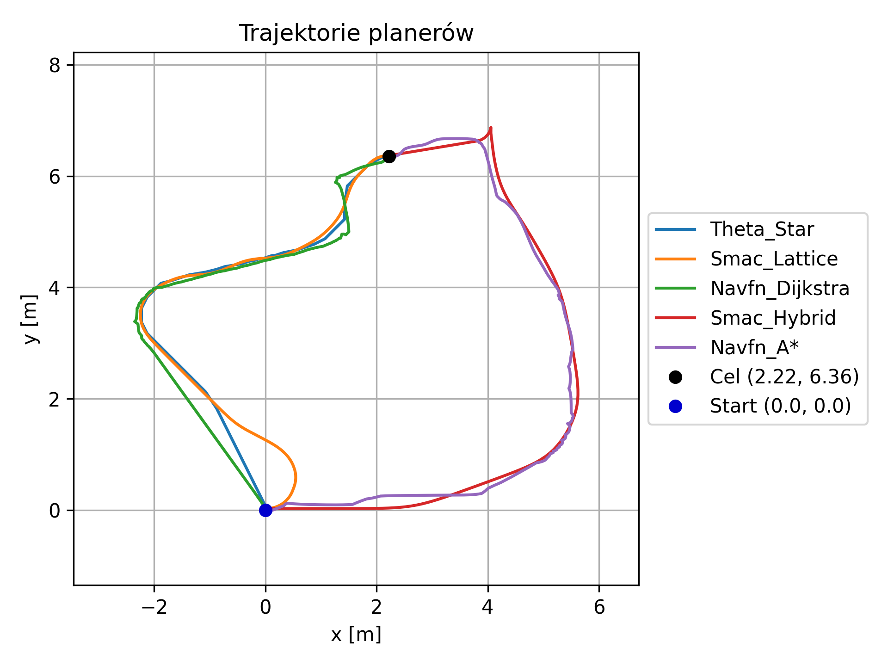

# Planners Testing – TIAGO OMNI Base ROS 2

Repozytorium służy do testowania różnych planerów ruchu w środowisku ROS 2 z użyciem robota TIAGo z bazą Omni. Skupiamy się na ocenie efektywności i niezawodności dostępnych planerów w środowisku symulacyjnym.

## 🎯 Cel projektu

* Uruchomienie symulacji robota Tiago Omni Base ([https://github.com/pal-robotics/omni\_base\_simulation/tree/humble-devel](https://github.com/pal-robotics/omni_base_simulation/tree/humble-devel)) i test nawigacji na wczytanej mapie zajętości ([https://docs.nav2.org/getting\_started/index.html#running-the-example](https://docs.nav2.org/getting_started/index.html#running-the-example))
* Konfiguracja i dostrojenie parametrów dla 4 różnych planerów ścieżki ([https://docs.nav2.org/plugins/index.html#planners](https://docs.nav2.org/plugins/index.html#planners));  porównanie cech przetestowanych algorytmów; porównanie metryk: czasu planowania, długości i kształtu ścieżek uzyskanych dla różnych punktów docelowych;
* Uruchomienie planner\_benchmarking ([https://github.com/ros-planning/navigation2/tree/main/tools/planner\_benchmarking](https://github.com/ros-planning/navigation2/tree/main/tools/planner_benchmarking))

## 🤖 Środowisko bazowe

Symulacja oparta jest na [omni\_base\_simulation (gałąź humble-devel)](https://github.com/pal-robotics/omni_base_simulation/tree/humble-devel?tab=readme-ov-file) od PAL Robotics, która zawiera pełną konfigurację.

## 🧪 Inicjalizacja środowiska

1. **Sklonuj repozytorium:**

   ```bash
   git clone https://github.com/Mateo755/Testing-ROS2-Planners-Tiago_OMNI.git ~/Testing-ROS2-Planners-Tiago_OMNI
   cd ~/Testing-ROS2-Planners-Tiago_OMNI
   ```
2. **Zainstaluj zależności za pomocą rosdep:**

   ```bash
   sudo rosdep init
   rosdep update
   rosdep install --from-paths src --ignore-src -r -y
   ```
3. **Zbuduj workspace:**

   ```bash
   source /opt/ros/humble/setup.bash
   colcon build --symlink-install
   ```
4. **Załaduj środowisko:**

   ```bash
   source install/setup.bash
   ```

## 🚀 Uruchomienie symulacji i testu planera

1. **W pierwszym terminalu uruchom symulację z Nav2:**

   ```bash
   ros2 launch omni_base_gazebo omni_base_gazebo.launch.py is_public_sim:=True navigation:=True
   ```
2. **W drugim terminalu uruchom test planera:**

   ```bash
   source ~/Testing-ROS2-Planners-Tiago_OMNI/install/setup.bash
   ros2 run planner_test test_planner
   ```

### ✅ Oczekiwany wynik testu planera

Po zakończeniu działania testu planera powinny pojawić się komunikaty potwierdzające poprawne wykonanie:

```
[INFO] [1747958543.999693298] [basic_navigator]: Nav2 is ready for use!
[INFO] [1747958544.003324916] [basic_navigator]: Getting path...
[INFO] [1747958544.093209688] [planner_tester]: Zapisano ścieżkę do: data/path_navfn_A*_2.22_6.36.csv
[INFO] [1747958544.094518251] [planner_tester]: Wyniki zapisane do: data/results_navfn_A*_2.22_6.36.csv
```

## 📊 Wizualizacja ścieżek – `path_plotting.py`

Do wizualizacji ścieżek wygenerowanych przez różne planery można użyć skryptu `path_plotting.py`. Skrypt tworzy wykresy porównujące trajektorie dla zadanych punktów docelowych.

### Uruchomienie:

Upewnij się, że znajdujesz się w głównym katalogu przestrzeni roboczej `~/Testing-ROS2-Planners-Tiago_OMNI`, a następnie wykonaj:

```bash
python3 path_plotting.py
```

### Co uzyskujemy:

* Wykres przedstawiający ścieżki wygenerowane przez różne planery dla jednego punktu docelowego.
* Zaznaczone pozycje startowe (0,0) oraz cel.
* Plik graficzny PNG zapisany w katalogu danego planu, np. `data/planners_compare/plan_-11.46_2.43/plot_-11.46_2.43.png`.

Przykład wygenerowanego wykresu:



Skrypt korzysta z danych CSV wygenerowanych przez testy planera i automatycznie wykrywa dostępne ścieżki do porównania.

## ℹ️ Uwaga

Wersja publiczna może nie zawierać `omni_drive_controller` — jest to oczekiwane w otwartym środowisku symulacyjnym.

Dodatkowe światy symulacyjne (np. korytarze) można uruchamiać przez parametr `world:=<nazwa_świata>`.

## 📁 Pliki dokumentacyjne

```
.
├── nav2_planners_documentation.md       # Opis planerów dostępnych w Nav2
├── planners_config_info.md              # Linki do dokumentacji parametrów planerów
├── planners_testing_setup.md            # Instrukcja uruchomienia i testowania planerów
├── requirements.txt                     # Lista zależności (m.in. matplotlib, pandas)
├── 🚩 **results_planners_testing.md**   # GŁÓWNY RAPORT: wyniki testów plannerów
```

**RAPORT z przeprowadzonych testów planerów:**
**[`results_planners_testing.md`](./results_planners_testing.md)** zawiera:

* Czas planowania, długość trasy, koszty i złożoność skrętów
* Tabele porównawcze dla kilku punktów docelowych
* Wizualizacje trajektorii w różnych planerach
* Rekomendacje dotyczące doboru planera do typu robota


