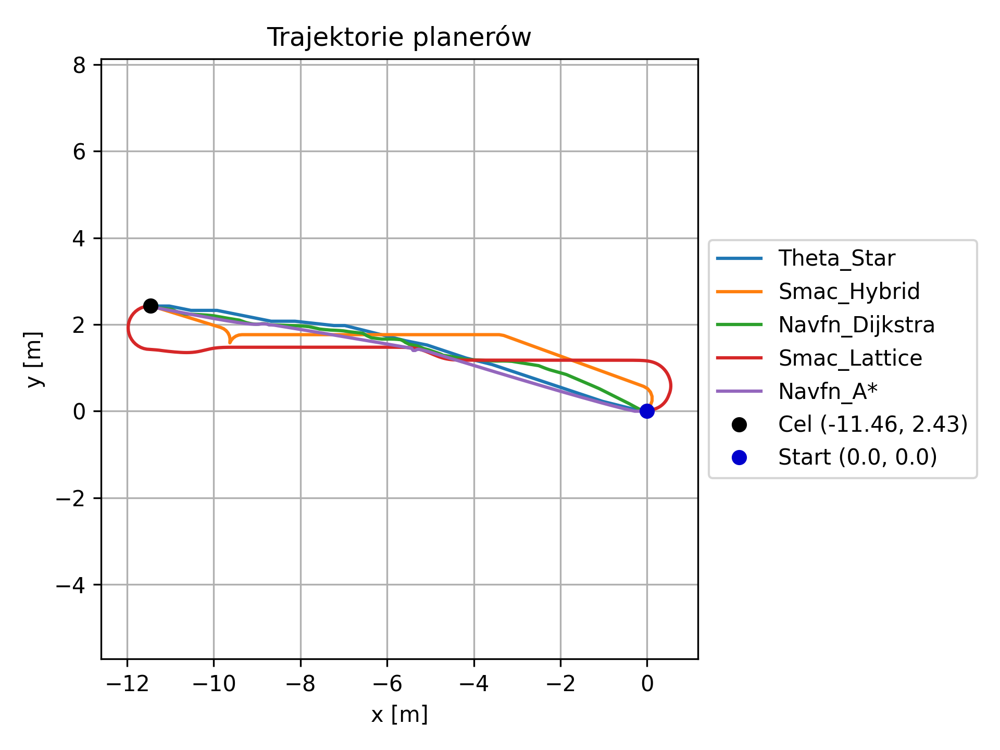
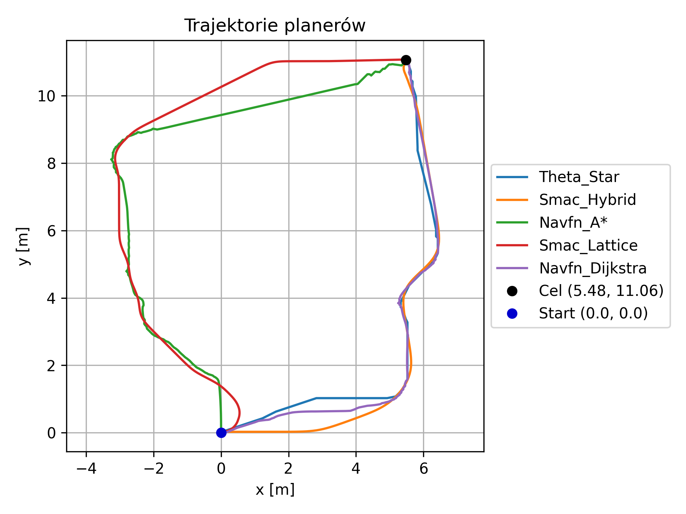

# Raport z testów plannerów nawigacyjnych Nav2

Poniższe zestawienie przedstawia wyniki testów porównawczych wybranych plannerów globalnych dla trzech różnych punktów docelowych. Testowano: `navfn_A*`, `navfn_dijkstra`, `theta_star`, `smac_hybrid`, `smac_lattice`.

---

## 📅 Testowane punkty docelowe

1. (-11.46, 2.43)
2. (2.22, 6.36)
3. (5.48, 11.06)

Dla każdego planera zebrano dane: czas planowania, długość ścieżki, średni koszt globalny, minimalny koszt, maksymalny koszt, odchylenie standardowe kosztu, złożoność trajektorii (liczba skrętów / zmiany kierunku).

---

## 🧪 Wyniki szczegółowe

### Test 1: Punkt docelowy (-11.46, 2.43)

| Planer       | Czas         | Długość       | Koszt | Min | Max | Std | Złożoność     |
| ------------ | ------------ | ------------- | ----- | --- | --- | --- | ------------- |
| navfn A\*    | 0.0705       | 11.7836       | 0     | 0   | 0   | 0.0 | 5.1984        |
| navfn (D.)   | 0.0747       | 11.8717       | 0     | 0   | 0   | 0.0 | 10.1399       |
| smac hybrid  | ✅ **0.0489** | 12.8323       | 0     | 0   | 0   | 0.0 | 10.7703       |
| smac lattice | ❌ **0.2228** | ❌ **14.8223** | 0     | 0   | 0   | 0.0 | ❌ **14.8223** |
| theta star   | 0.0538       | ✅ **11.779**  | 0     | 0   | 0   | 0.0 | ✅ **1.6581**  |

### Test 2: Punkt docelowy (2.22, 6.36)

| Planer       | Czas         | Długość       | Koszt | Min | Max | Std   | Złożoność     |
| ------------ | ------------ | ------------- | ----- | --- | --- | ----- | ------------- |
| navfn A\*    | 0.0857       | 13.534        | ✅ **37.56** | 0   | 195 | ✅ **63.58** | ❌ **48.6016** |
| navfn (D.)   | 0.1141       | 10.7294       | 65.54 | 0   | ✅ **160** | 65.89 | 41.6069       |
| smac hybrid  | ❌ **1.887**  | ❌ **13.5877** | 45.7  | 0   | 222 | 69.92 | ✅ **6.7703**  |
| smac lattice | 1.2634       | 10.7259       | 68.23 | 0   | ❌ **228** | ❌ **76.01** | 8.292         |
| theta star   | ✅ **0.0734** | ✅ **10.0305** | ❌ **75.41** | 0   | 186 | 67.95 | 8.1352        |

### Test 3: Punkt docelowy (5.48, 11.06)

| Planer       | Czas         | Długość       | Koszt      | Min | Max | Std   | Złożoność     |
| ------------ | ------------ | ------------- | ---------- | --- | --- | ----- | ------------- |
| navfn A\*    | ✅ **0.1073** | ❌ **19.8622** | 6.11       | 0   | ✅ **121** | 25.11 | ❌ **127.848** |
| navfn (D.)   | 0.1113       | 16.2569       | 15.61      | 0   | 170 | 44.02 | 49.5707       |
| smac hybrid  | 0.7224       | 16.1678       | ❌ **24.61** | 0   | ❌ **206** | ❌ **56.2**  | 7.9018        |
| smac lattice | ❌ **1.1872** | 19.3695       | ✅ **4.91** | 0   | ✅ **121** | ✅ **22.85** | ✅ **6.9008**  |
| theta star   | 0.1176       | ✅ **16.0518** | 15.75      | 0   | 170 | 44.57 | 10.6622       |

---

## 🗺️ Wyniki trajektorii wytyczonych przez planery

W poniższych wykresach przedstawiono ścieżki wygenerowane przez różne planery dla każdego z testowanych punktów docelowych.

---

## 📊 Ogólne wnioski z testów

### ✅ Czas planowania

* **Najszybsze**: `theta_star`, `navfn_*` (≈ 0.05–0.1 s)
* **Najwolniejsze**: `smac_lattice`, `smac_hybrid` (do 1.8 s)

### ✅ Długość ścieżki

* Najkrótsze trasy: `theta_star`, `navfn (D.)`
* Najdłuższe: `navfn_A*` (do 19.86 m w Teście 3)

### ✅ Koszt globalny ścieżki

* Najniższy: `smac_lattice` (nawet 4.91 w Teście 3)
* Najwyższy: `theta_star`, `smac_hybrid` (do 75.41)

### ✅ Złożoność trajektorii (skręty)

* **Najbardziej naturalne ścieżki**: `theta_star`, `smac_lattice`
* **Najbardziej nienaturalne**: `navfn_A*` (do 127 rad)

---

## 🏆 Podsumowanie planerów

| Planner          | Cechy dominujące                                                                |
| ---------------- | ------------------------------------------------------------------------------- |
| **NavFn A\***    | ✅ bardzo szybki, ❌ duża złożoność, ❌ wysokie koszty na skomplikowanych mapach   |
| **NavFn D.**     | ✅ szybki, ❌ dłuższe trasy, ❌ nieoptymalny koszt                                 |
| **Theta\***      | ✅ krótka i gładka ścieżka, ✅ niski czas, ⚠️ możliwe wyższe koszty               |
| **Smac Hybrid**  | ❌ wolny, ✅ dobra jakość trasy, ✅ zgodność z orientacją                          |
| **Smac Lattice** | ✅ niski koszt, ❌ wolniejszy, ✅ bardzo naturalna trajektoria |

---

## 🔁 Rekomendacje

* **Do szybkich zadań testowych**: `navfn_A*`, `theta_star`
* **Do robotów z ograniczeniami ruchu**: `smac_hybrid`, `smac_lattice`
* **Najlepsza jakość ścieżek (koszt + gładkość)**: `smac_lattice`

---

*Dane zbierane automatycznie przez `planner_tester.py`, wizualizowane i analizowane w Python.*
